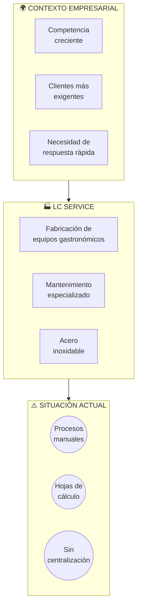
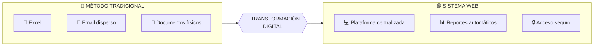
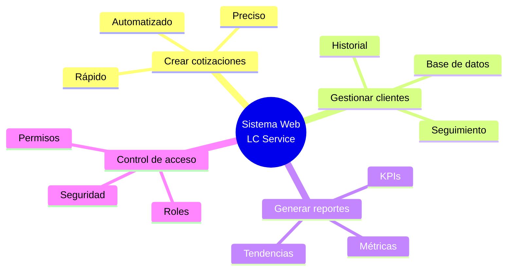
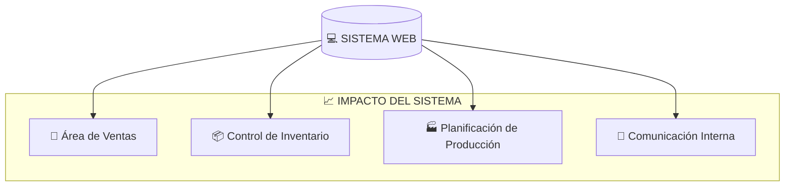

# Introducción

[← Volver al Índice](./README.md) | [Siguiente: Planteamiento del Problema →](./02-planteamiento-problema/README.md)

---

## Contexto del Proyecto

En la actualidad, las empresas del sector de fabricación y mantenimiento de equipos gastronómicos enfrentan desafíos crecientes en cuanto a la **eficiencia operativa**, la **competitividad** y la **satisfacción del cliente**. Estos retos se intensifican por la demanda de respuestas rápidas y precisas a solicitudes comerciales, especialmente en procesos de cotización.

---

## La Empresa: LC Service

**LC Service** es una empresa dedicada a la fabricación y mantenimiento de equipos gastronómicos de acero inoxidable. La gestión de cotizaciones es un proceso crucial para el área de ventas, pues constituye el primer contacto formal con el cliente y puede determinar el cierre de una negociación.

### Situación Problemática

| Aspecto | Problema Identificado |
|---------|----------------------|
| **Método** | Proceso manual con hojas de cálculo dispersas |
| **Comunicación** | Canales no centralizados |
| **Resultado** | Demoras, errores de transcripción, dificultad de seguimiento |

---

## La Solución: Transformación Digital

La **transformación digital** emerge como una solución estratégica para modernizar los procesos internos y mejorar la capacidad de respuesta al cliente.

---

## Propuesta de Investigación

El presente trabajo se enmarca en el diseño e implementación de un **sistema web** orientado a la gestión integral de cotizaciones para LC Service, con un enfoque basado en la transformación digital.

### Objetivos del Sistema

---

## Beneficios Esperados

| Beneficio | Descripción |
|-----------|-------------|
| ⏱️ **Reducción de tiempo** | Menor tiempo en elaboración de cotizaciones |
| ✅ **Minimizar errores** | Datos precisos y validados |
| 📊 **Seguimiento eficiente** | Trazabilidad de cada solicitud |
| 📈 **Decisiones estratégicas** | Reportes basados en datos reales |

---

## Impacto Organizacional

---

## Alcance del Proyecto

Este proyecto no solo tendrá un impacto interno en la empresa, sino que también puede servir como **referencia para otras organizaciones** del mismo rubro que enfrentan retos similares. La experiencia obtenida en este proceso de diseño e implementación podrá ser replicada y adaptada en distintos contextos.

---

[← Índice](./README.md) | [**Siguiente: Planteamiento del Problema →**](./02-planteamiento-problema/README.md)

