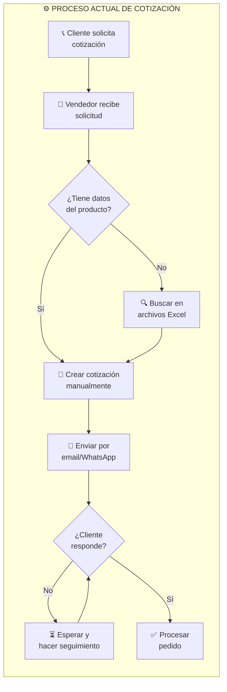
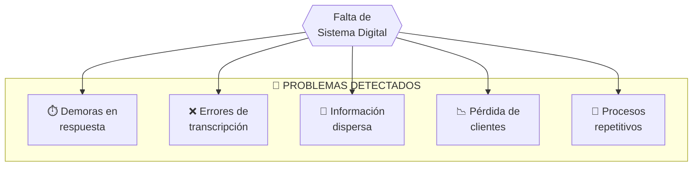
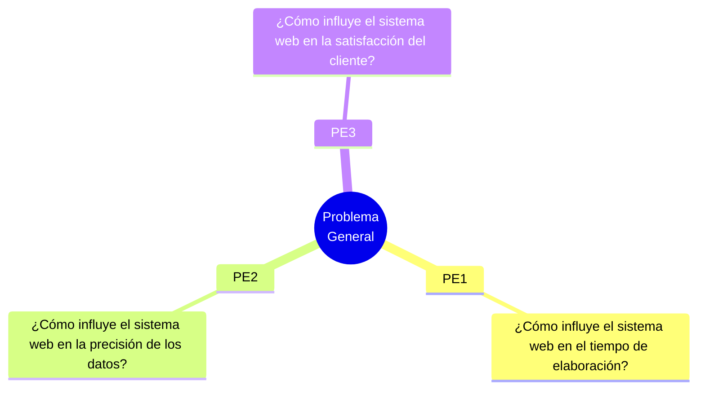
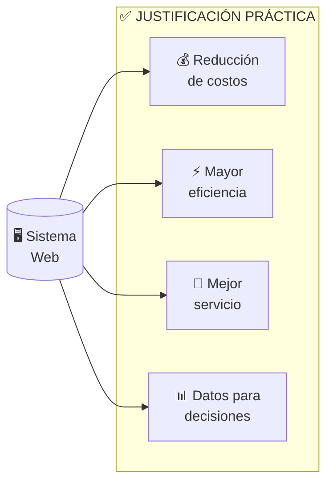
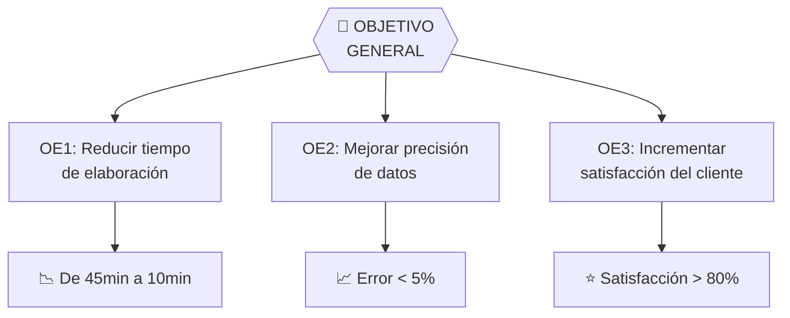
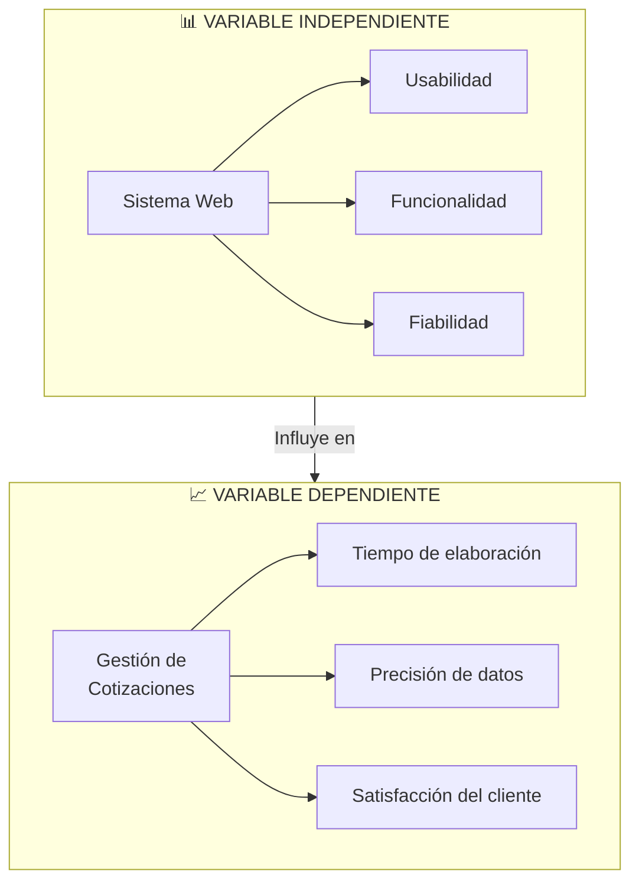

# I. Planteamiento del Problema

[← Introducción](../01-introduccion.md) | [Índice](../README.md) | [Marco Teórico →](../03-marco-teorico/README.md)

---

## Contenido del Capítulo

| Sección | Descripción |
|---------|-------------|
| [1.1 Realidad Problemática](#11-realidad-problemática) | Diagnóstico de la situación actual |
| [1.2 Formulación del Problema](#12-formulación-del-problema) | Preguntas de investigación |
| [1.3 Justificación](#13-justificación-e-importancia) | Razones del estudio |
| [1.4 Objetivos](#14-objetivos) | General y específicos |
| [1.5 Hipótesis](#15-hipótesis) | Planteamientos a demostrar |
| [1.6 Variables](#16-variables) | Operacionalización |

---

## 1.1 Realidad Problemática

### Diagnóstico del Proceso Actual

### Problemas Identificados

### Indicadores Críticos

| Indicador | Situación Actual | Impacto |
|-----------|-----------------|---------|
| Tiempo promedio por cotización | 45-60 minutos | Alto |
| Tasa de errores | 15-20% | Alto |
| Cotizaciones perdidas | ~30% sin seguimiento | Crítico |
| Satisfacción del cliente | Baja | Alto |

---

## 1.2 Formulación del Problema

### Problema General

> **¿De qué manera la implementación de un sistema web optimiza la gestión de cotizaciones con enfoque en transformación digital en la empresa LC Service?**

### Problemas Específicos

| # | Problema Específico |
|---|---------------------|
| PE1 | ¿De qué manera el sistema web reduce el **tiempo de elaboración** de cotizaciones? |
| PE2 | ¿De qué manera el sistema web mejora la **precisión de los datos** en las cotizaciones? |
| PE3 | ¿De qué manera el sistema web incrementa la **satisfacción del cliente**? |

---

## 1.3 Justificación e Importancia

### Justificación Teórica

El estudio aporta conocimiento sobre la aplicación de tecnologías web en procesos comerciales de PYMES del sector gastronómico.

### Justificación Práctica

### Justificación Metodológica

Se valida un instrumento de medición para evaluar sistemas web en gestión de cotizaciones.

---

## 1.4 Objetivos

### Objetivo General

> **Implementar un sistema web para optimizar la gestión de cotizaciones con enfoque en transformación digital en la empresa LC Service.**

### Objetivos Específicos

---

## 1.5 Hipótesis

### Hipótesis General

> **La implementación del sistema web optimiza significativamente la gestión de cotizaciones con enfoque en transformación digital en la empresa LC Service.**

### Hipótesis Específicas

| # | Hipótesis |
|---|-----------|
| HE1 | El sistema web **reduce significativamente** el tiempo de elaboración de cotizaciones |
| HE2 | El sistema web **mejora significativamente** la precisión de los datos |
| HE3 | El sistema web **incrementa significativamente** la satisfacción del cliente |

---

## 1.6 Variables

### Operacionalización de Variables

### Matriz de Operacionalización

| Variable | Dimensión | Indicador | Instrumento |
|----------|-----------|-----------|-------------|
| **Sistema Web** (VI) | Usabilidad | Facilidad de uso | Cuestionario SUS |
| | Funcionalidad | Cumplimiento de requerimientos | Lista de verificación |
| | Fiabilidad | Disponibilidad del sistema | Monitoreo |
| **Gestión de Cotizaciones** (VD) | Tiempo | Minutos por cotización | Cronómetro/logs |
| | Precisión | % de errores | Revisión de datos |
| | Satisfacción | Nivel de satisfacción | Encuesta Likert |

---

[← Introducción](../01-introduccion.md) | [Índice](../README.md) | [**Marco Teórico →**](../03-marco-teorico/README.md)

