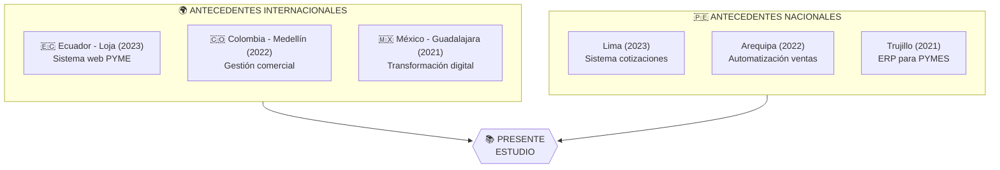
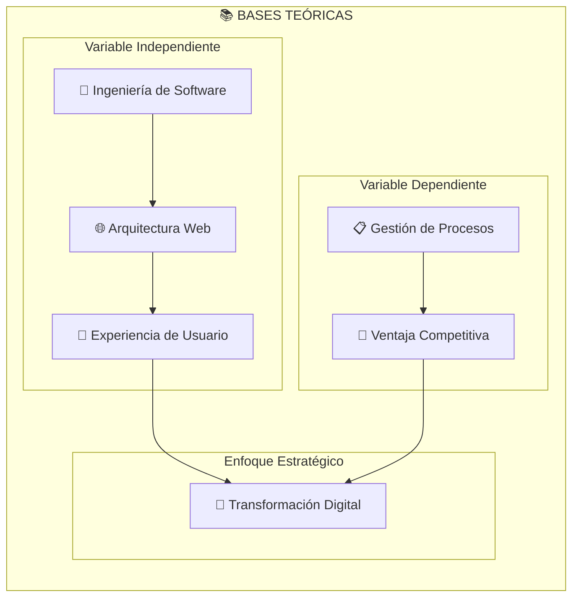
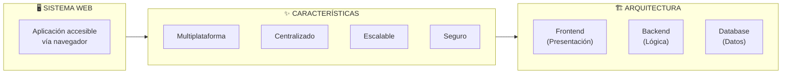
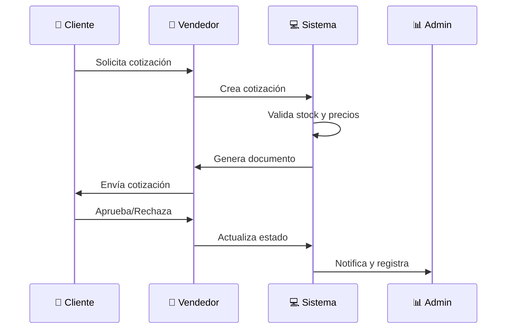
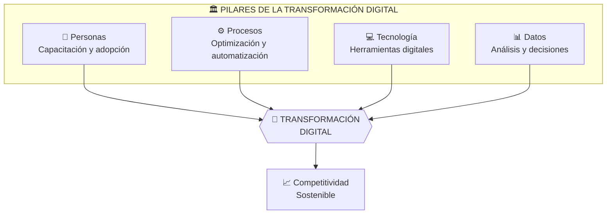
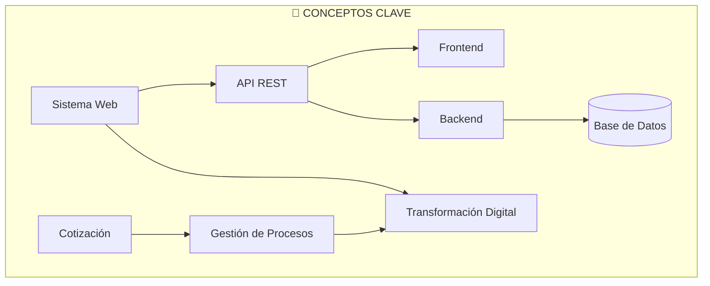

# II. Marco Teórico

[← Planteamiento del Problema](../02-planteamiento-problema/README.md) | [Índice](../README.md) | [Metodología →](../04-metodologia/README.md)

---

## Contenido del Capítulo

| Sección | Descripción |
|---------|-------------|
| [2.1 Antecedentes](#21-antecedentes) | Investigaciones previas |
| [2.2 Fundamentos Teóricos](#22-fundamentos-teóricos) | Bases conceptuales |
| [2.3 Glosario](#23-definición-de-términos) | Términos clave |

---

## 2.1 Antecedentes

### Mapa de Antecedentes

### Resumen de Antecedentes

| Autor (Año) | País | Conclusión Principal |
|-------------|------|---------------------|
| García et al. (2023) | Ecuador | Reducción del 60% en tiempo de procesos |
| Martínez (2022) | Colombia | Mejora del 45% en satisfacción del cliente |
| López (2021) | México | Incremento del 35% en ventas cerradas |
| Pérez (2023) | Perú | Disminución del 70% en errores |

---

## 2.2 Fundamentos Teóricos

### Modelo Conceptual

### Sistema Web (Variable Independiente)

### Gestión de Cotizaciones (Variable Dependiente)

La gestión de cotizaciones comprende el conjunto de actividades orientadas a la elaboración, seguimiento y cierre de propuestas comerciales.

### Transformación Digital

---

## 2.3 Definición de Términos

### Glosario Técnico

| Término | Definición |
|---------|------------|
| **Sistema Web** | Aplicación de software accesible a través de un navegador web |
| **API REST** | Interfaz de programación que utiliza protocolo HTTP para comunicación |
| **Frontend** | Capa de presentación e interacción con el usuario |
| **Backend** | Capa de lógica de negocio y procesamiento de datos |
| **Base de Datos** | Sistema de almacenamiento estructurado de información |
| **Cotización** | Documento comercial con propuesta de precios y condiciones |
| **PYME** | Pequeña y Mediana Empresa |
| **UX/UI** | Experiencia de Usuario / Interfaz de Usuario |

### Relación de Conceptos

---

## Recursos Adicionales

- [Detalles de Antecedentes](./antecedentes.md)
- [Fundamentos Teóricos Extendidos](./fundamentos-teoricos.md)
- [Glosario Completo](./glosario.md)

---

[← Planteamiento](../02-planteamiento-problema/README.md) | [Índice](../README.md) | [**Metodología →**](../04-metodologia/README.md)

