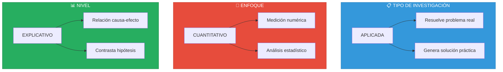
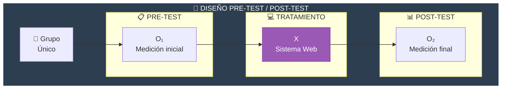
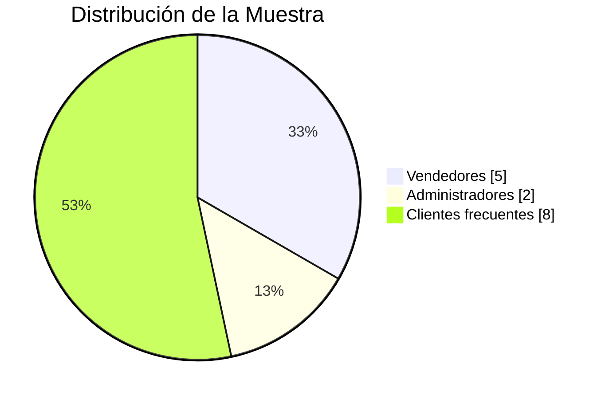
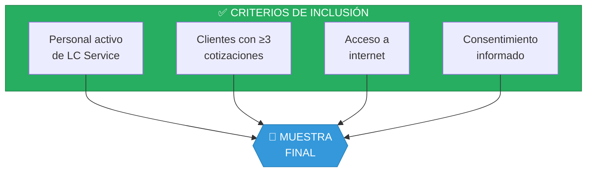
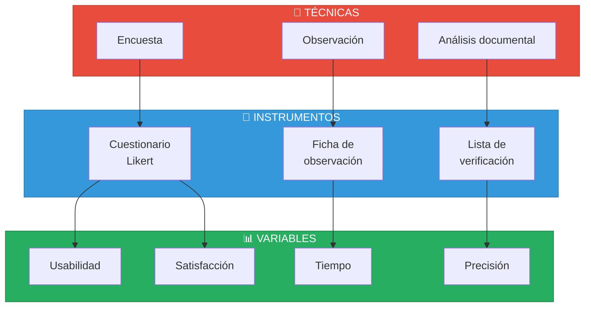
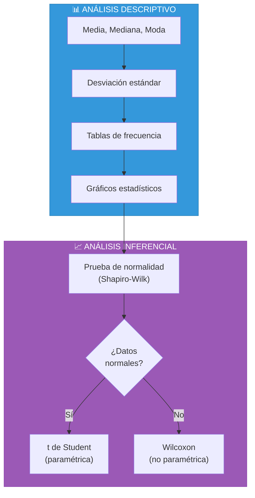
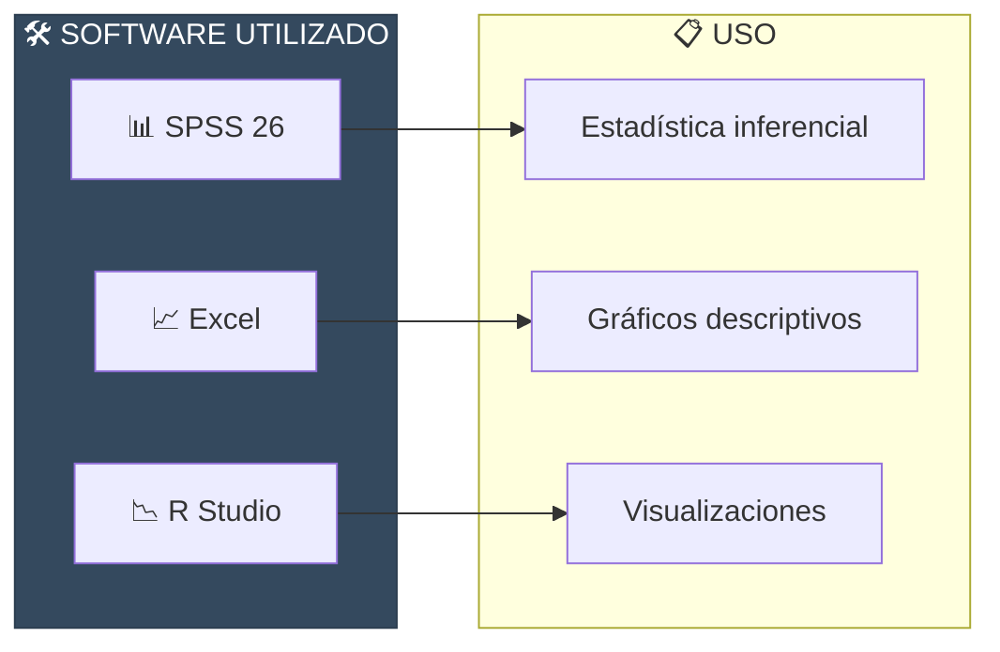
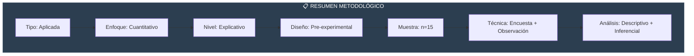

# III. Metodología

[← Marco Teórico](../03-marco-teorico/README.md) | [Índice](../README.md) | [El Sistema →](../05-sistema/README.md)

---

## Contenido del Capítulo

| Sección | Descripción |
|---------|-------------|
| [3.1 Tipo y Nivel](#31-tipo-y-nivel-de-investigación) | Enfoque metodológico |
| [3.2 Diseño](#32-diseño-de-investigación) | Estructura del estudio |
| [3.3 Población y Muestra](#33-población-y-muestra) | Sujetos de estudio |
| [3.4 Técnicas e Instrumentos](#34-técnicas-e-instrumentos) | Herramientas de recolección |
| [3.5 Análisis de Datos](#35-análisis-de-datos) | Métodos estadísticos |

---

## 3.1 Tipo y Nivel de Investigación

### Clasificación del Estudio



| Característica | Clasificación | Justificación |
|----------------|---------------|---------------|
| **Tipo** | Aplicada | Soluciona problema real en LC Service |
| **Enfoque** | Cuantitativo | Medición de indicadores numéricos |
| **Nivel** | Explicativo | Determina influencia del sistema web |

---

## 3.2 Diseño de Investigación

### Diseño Pre-Experimental



### Esquema del Diseño

```
G: O₁ → X → O₂
```

Donde:
- **G** = Grupo de estudio (personal de ventas)
- **O₁** = Pre-test (medición sin sistema)
- **X** = Implementación del sistema web
- **O₂** = Post-test (medición con sistema)

---

## 3.3 Población y Muestra

### Estructura de la Muestra



| Elemento | Descripción | Cantidad |
|----------|-------------|----------|
| **Población** | Personal de LC Service + clientes frecuentes | N = 20 |
| **Muestra** | Censo (población completa) | n = 15 |
| **Muestreo** | No probabilístico, intencional | - |

### Criterios de Inclusión



---

## 3.4 Técnicas e Instrumentos

### Matriz de Técnicas e Instrumentos



### Instrumentos Detallados

| Instrumento | Técnica | Variable | Escala |
|-------------|---------|----------|--------|
| Cuestionario SUS | Encuesta | Usabilidad | 1-5 Likert |
| Cronómetro/Logs | Observación | Tiempo | Minutos |
| Lista de cotejo | Análisis | Precisión | % error |
| Encuesta CSAT | Encuesta | Satisfacción | 1-5 Likert |

---

## 3.5 Análisis de Datos

### Plan de Análisis



### Criterios de Decisión

| Nivel de Significancia | Decisión |
|------------------------|----------|
| p < 0.05 | Rechazar H₀ (diferencia significativa) |
| p ≥ 0.05 | No rechazar H₀ (sin diferencia significativa) |

### Herramientas de Análisis



---

## Resumen Metodológico



---

<div align="center">

[← Marco Teórico](../03-marco-teorico/README.md) | [Índice](../README.md) | [**El Sistema →**](../05-sistema/README.md)

</div>
