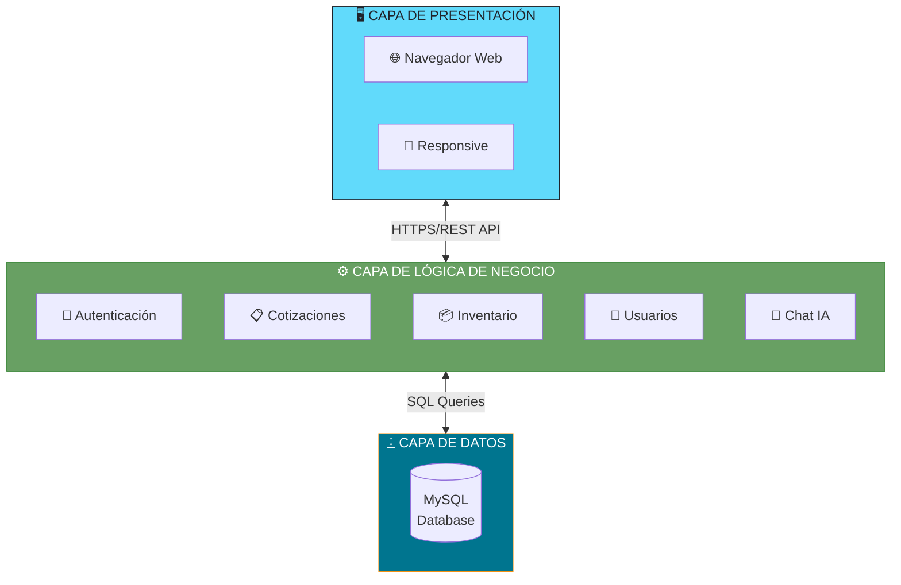
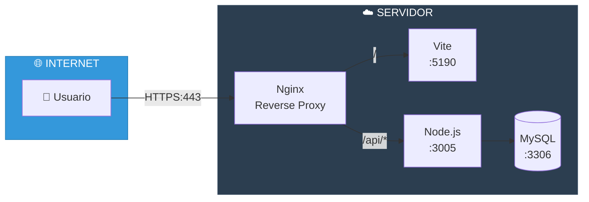
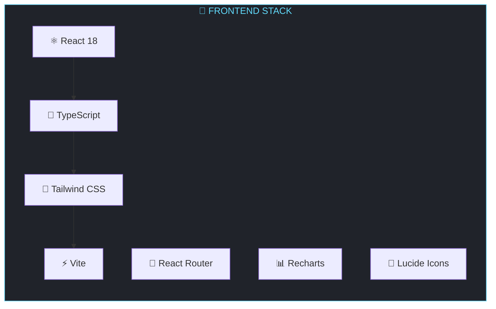
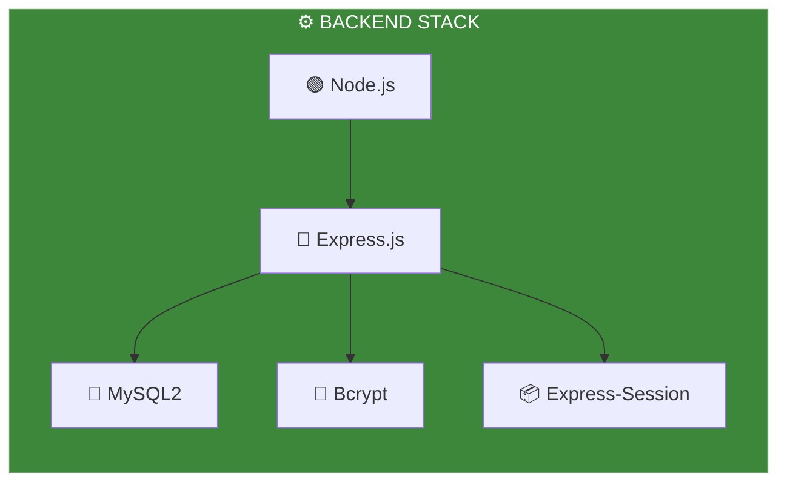
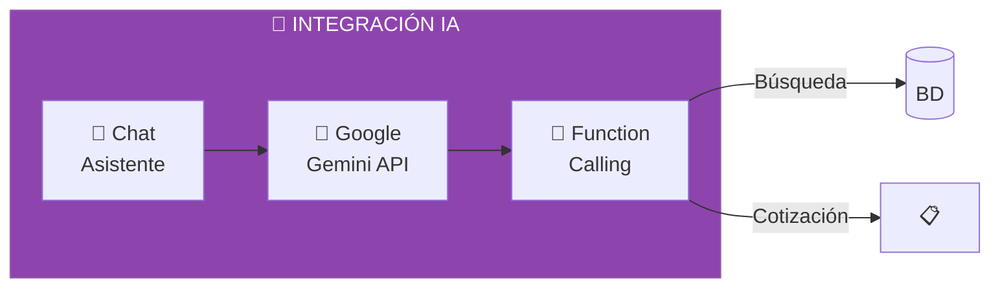
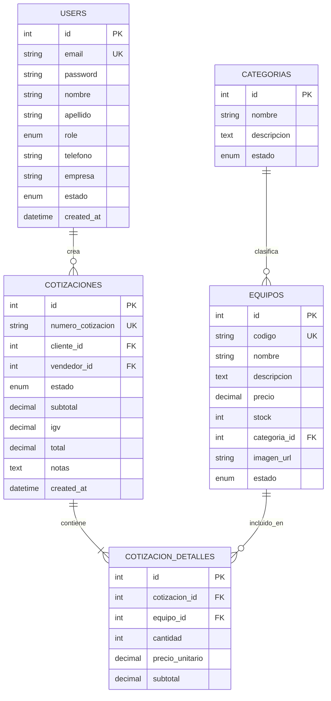
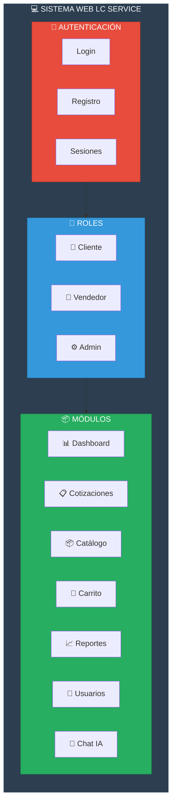
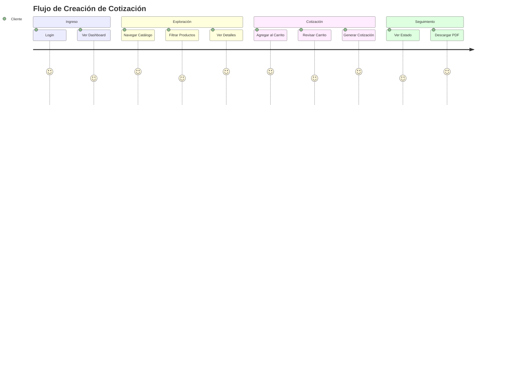

# IV. El Sistema Web

[← Metodología](../04-metodologia/README.md) | [Índice](../README.md) | [Resultados →](../06-resultados.md)

---

## Contenido del Capítulo

| Sección | Descripción |
|---------|-------------|
| [4.1 Arquitectura](#41-arquitectura-del-sistema) | Diseño técnico |
| [4.2 Tecnologías](#42-stack-tecnológico) | Herramientas utilizadas |
| [4.3 Base de Datos](#43-modelo-de-datos) | Estructura de información |
| [4.4 Módulos](#44-módulos-del-sistema) | Funcionalidades |
| [4.5 Interfaces](#45-interfaces-de-usuario) | Pantallas principales |

---

## 4.1 Arquitectura del Sistema

### Arquitectura de 3 Capas

### Arquitectura de Despliegue

---

## 4.2 Stack Tecnológico

### Frontend

| Tecnología | Versión | Propósito |
|------------|---------|-----------|
| React | 18.x | Librería UI |
| TypeScript | 5.x | Tipado estático |
| Tailwind CSS | 3.x | Estilos utilitarios |
| Vite | 5.x | Build tool |
| React Router | 6.x | Navegación SPA |
| Recharts | 2.x | Gráficos y reportes |

### Backend

| Tecnología | Versión | Propósito |
|------------|---------|-----------|
| Node.js | 20.x | Runtime JavaScript |
| Express | 4.x | Framework HTTP |
| MySQL2 | 3.x | Driver de BD |
| Bcrypt | 5.x | Hash de contraseñas |
| Express-Session | 1.x | Manejo de sesiones |

### Inteligencia Artificial

---

## 4.3 Modelo de Datos

### Diagrama Entidad-Relación

### Relaciones Principales

| Tabla | Relación | Tabla |
|-------|----------|-------|
| users | 1:N | cotizaciones (como cliente) |
| users | 1:N | cotizaciones (como vendedor) |
| cotizaciones | 1:N | cotizacion_detalles |
| equipos | 1:N | cotizacion_detalles |
| categorias | 1:N | equipos |

---

## 4.4 Módulos del Sistema

### Mapa de Módulos

### Matriz de Permisos por Rol

| Módulo | Cliente | Vendedor | Admin |
|--------|:-------:|:--------:|:-----:|
| Dashboard | ✅ | ✅ | ✅ |
| Ver Catálogo | ✅ | ✅ | ✅ |
| Crear Cotización | ✅ | ✅ | ✅ |
| Ver Mis Cotizaciones | ✅ | ✅ | ✅ |
| Ver Todas las Cotizaciones | ❌ | ❌ | ✅ |
| Gestionar Inventario | ❌ | ❌ | ✅ |
| Gestionar Usuarios | ❌ | ❌ | ✅ |
| Reportes Avanzados | ❌ | ✅ | ✅ |
| Chat IA | ✅ | ✅ | ✅ |

---

## 4.5 Interfaces de Usuario

### Flujo de Usuario

### Pantallas Principales

| Pantalla | Descripción | Rol |
|----------|-------------|-----|
| Login | Autenticación de usuarios | Todos |
| Dashboard | Panel principal con KPIs | Todos |
| Catálogo | Lista de productos con filtros | Todos |
| Carrito | Productos seleccionados | Cliente/Vendedor |
| Nueva Cotización | Formulario de cotización | Cliente/Vendedor |
| Mis Cotizaciones | Lista de cotizaciones propias | Todos |
| Reportes | Gráficos y estadísticas | Admin |
| Chat IA | Asistente virtual Decatron | Todos |

---

## Recursos Adicionales

- [Arquitectura Detallada](./arquitectura.md)
- [Manual de Usuario](./manual-usuario.md)
- [API Reference](./api-reference.md)

---

[← Metodología](../04-metodologia/README.md) | [Índice](../README.md) | [**Resultados →**](../06-resultados.md)

