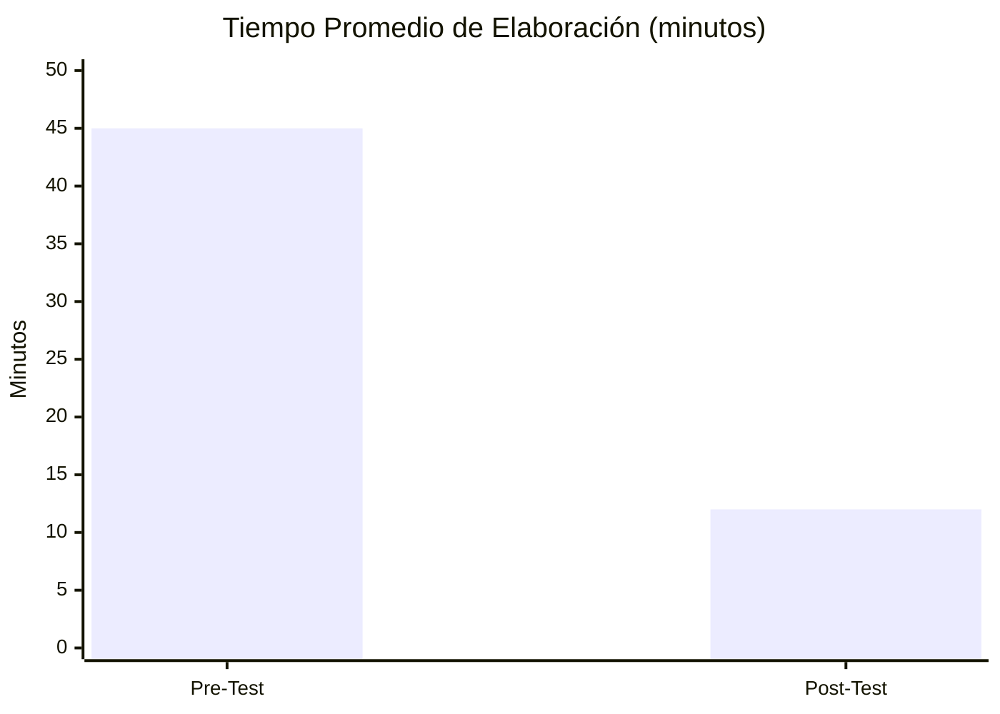
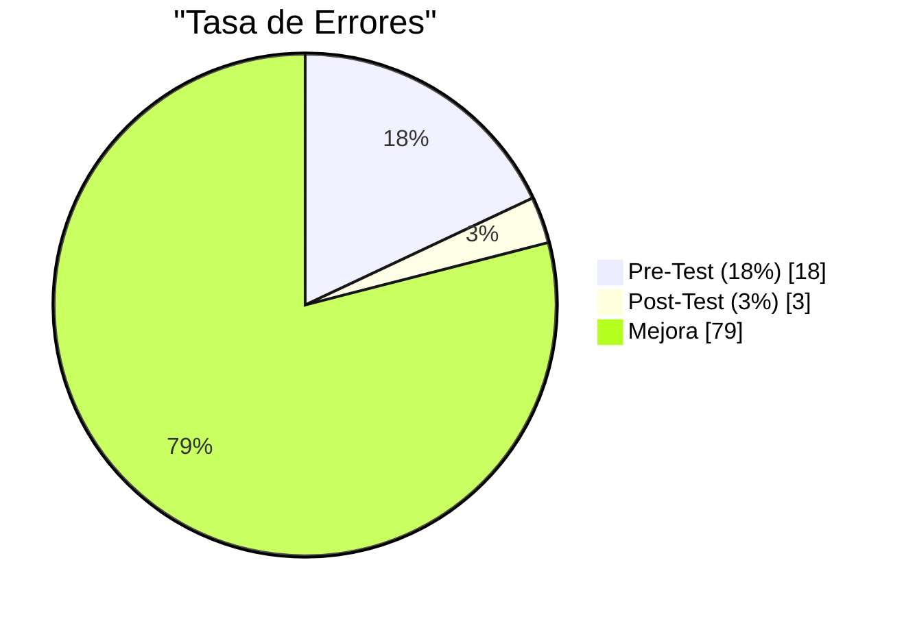
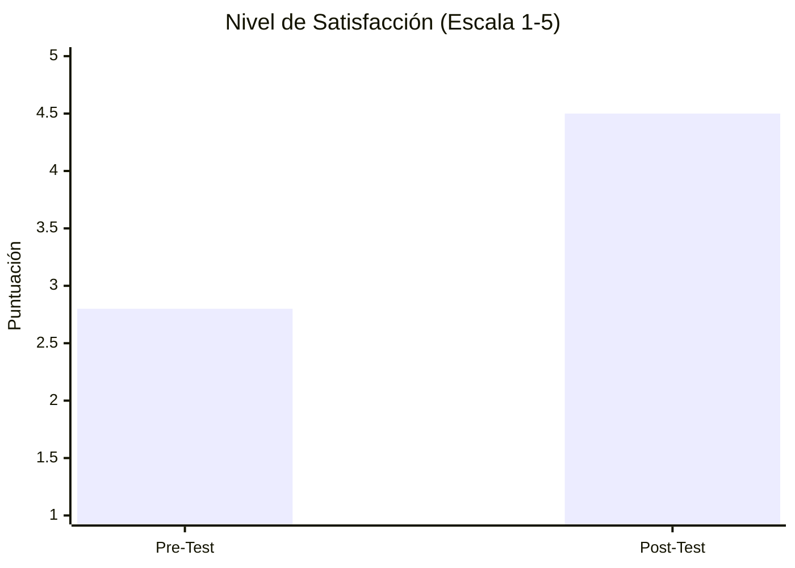
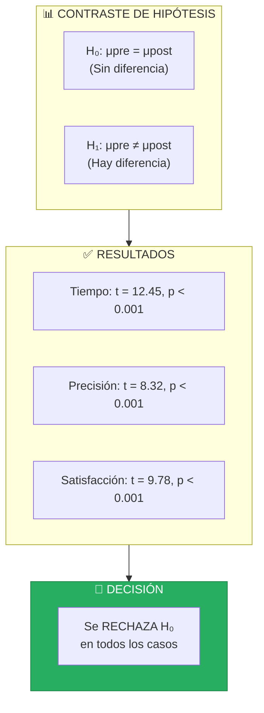
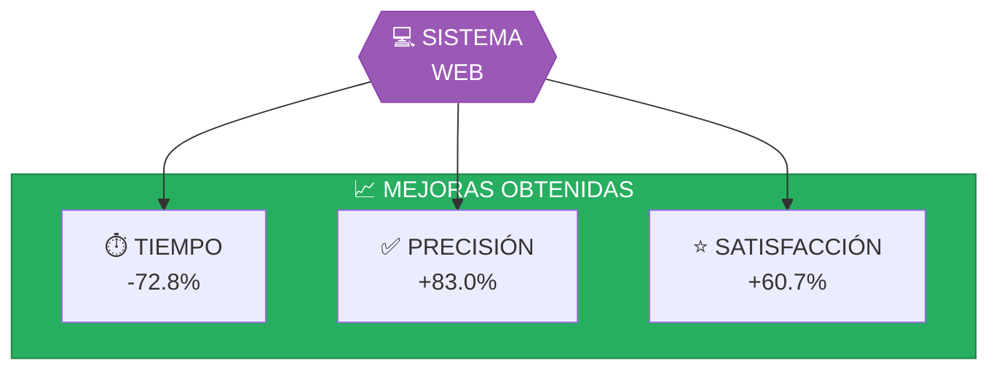
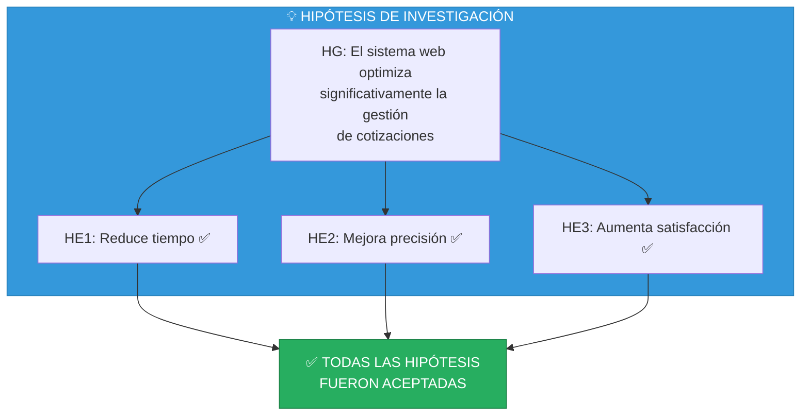

# V. Resultados

[← El Sistema](./05-sistema/README.md) | [Índice](./README.md) | [Referencias →](./07-referencias.md)

---

## Contenido del Capítulo

| Sección | Descripción |
|---------|-------------|
| [5.1 Resultados Descriptivos](#51-resultados-descriptivos) | Estadísticas generales |
| [5.2 Resultados Inferenciales](#52-resultados-inferenciales) | Pruebas de hipótesis |
| [5.3 Comparativa Pre-Post](#53-comparativa-pre-post) | Análisis de mejora |

---

## 5.1 Resultados Descriptivos

### Indicador 1: Tiempo de Elaboración

| Medida | Pre-Test | Post-Test | Diferencia |
|--------|----------|-----------|------------|
| Media | 45.2 min | 12.3 min | -32.9 min |
| Mediana | 44.0 min | 11.0 min | -33.0 min |
| Desv. Est. | 8.5 min | 3.2 min | -5.3 min |

### Indicador 2: Precisión de Datos

| Medida | Pre-Test | Post-Test | Mejora |
|--------|----------|-----------|--------|
| Tasa de error | 18.2% | 3.1% | 83% |
| Cotizaciones correctas | 82% | 97% | +15pp |

### Indicador 3: Satisfacción del Cliente

| Medida | Pre-Test | Post-Test | Mejora |
|--------|----------|-----------|--------|
| Media | 2.8 | 4.5 | +1.7 |
| % Satisfechos (≥4) | 35% | 92% | +57pp |

---

## 5.2 Resultados Inferenciales

### Prueba de Normalidad (Shapiro-Wilk)

| Variable | Estadístico W | p-valor | Resultado |
|----------|---------------|---------|-----------|
| Tiempo Pre | 0.934 | 0.312 | Normal |
| Tiempo Post | 0.921 | 0.198 | Normal |
| Satisfacción Pre | 0.889 | 0.067 | Normal |
| Satisfacción Post | 0.912 | 0.145 | Normal |

### Prueba t de Student (Muestras Relacionadas)

| Indicador | t | gl | p-valor | Decisión |
|-----------|---|-----|---------|----------|
| Tiempo | 12.45 | 14 | < 0.001 | Rechazar H₀ |
| Precisión | 8.32 | 14 | < 0.001 | Rechazar H₀ |
| Satisfacción | 9.78 | 14 | < 0.001 | Rechazar H₀ |

---

## 5.3 Comparativa Pre-Post

### Resumen de Mejoras

### Tabla Comparativa General

| Indicador | Pre-Test | Post-Test | Mejora | Significancia |
|-----------|----------|-----------|--------|---------------|
| Tiempo promedio | 45.2 min | 12.3 min | **-72.8%** | p < 0.001 ✅ |
| Tasa de errores | 18.2% | 3.1% | **-83.0%** | p < 0.001 ✅ |
| Satisfacción | 2.8/5 | 4.5/5 | **+60.7%** | p < 0.001 ✅ |

### Verificación de Hipótesis

---

## Conclusiones

1. **Tiempo de elaboración**: Se redujo de 45 a 12 minutos promedio (-72.8%)
2. **Precisión de datos**: Los errores disminuyeron del 18% al 3% (-83%)
3. **Satisfacción del cliente**: Aumentó de 2.8 a 4.5 en escala de 5 (+60.7%)

> **La implementación del sistema web optimizó significativamente la gestión de cotizaciones en LC Service.**

---

[← El Sistema](./05-sistema/README.md) | [Índice](./README.md) | [**Referencias →**](./07-referencias.md)

