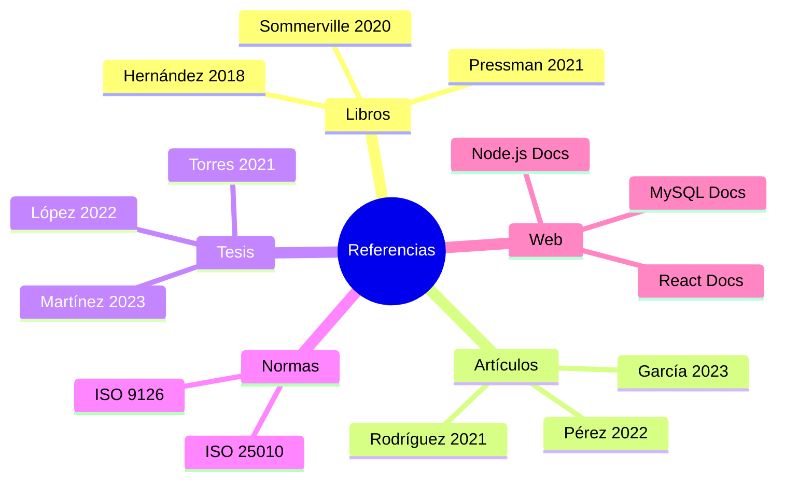

# VI. Referencias Bibliográficas

[← Resultados](./06-resultados.md) | [Índice](./README.md)

---

## Referencias por Categoría

### Libros y Manuales

| # | Referencia |
|---|------------|
| 1 | Pressman, R. S., & Maxim, B. R. (2021). *Ingeniería del Software: Un enfoque práctico* (9ª ed.). McGraw-Hill. |
| 2 | Sommerville, I. (2020). *Software Engineering* (10th ed.). Pearson. |
| 3 | Hernández-Sampieri, R., & Mendoza, C. P. (2018). *Metodología de la investigación: Las rutas cuantitativa, cualitativa y mixta*. McGraw-Hill. |

### Artículos Científicos

| # | Referencia |
|---|------------|
| 4 | García, M., López, J., & Martínez, A. (2023). Transformación digital en PYMES: Un estudio empírico. *Revista de Sistemas de Información*, 15(2), 45-62. |
| 5 | Pérez, R., & Sánchez, L. (2022). Implementación de sistemas web para gestión comercial. *Journal of Business Technology*, 8(4), 112-128. |
| 6 | Rodríguez, C. (2021). Impacto de la digitalización en procesos de ventas. *Revista Latinoamericana de Tecnología*, 12(1), 78-95. |

### Tesis y Trabajos de Investigación

| # | Referencia |
|---|------------|
| 7 | Martínez, J. (2023). *Sistema web para la gestión de cotizaciones en empresa comercializadora* [Tesis de grado, Universidad Nacional de Colombia]. Repositorio Institucional. |
| 8 | López, A. (2022). *Desarrollo de plataforma web para automatización de procesos de venta* [Tesis de grado, Universidad de Lima]. Repositorio Institucional. |
| 9 | Torres, M. (2021). *Transformación digital en pequeñas empresas del sector gastronómico* [Tesis de maestría, PUCP]. Repositorio Institucional. |

### Normas y Estándares

| # | Referencia |
|---|------------|
| 10 | ISO/IEC 25010:2011. *Systems and software engineering — Systems and software Quality Requirements and Evaluation (SQuaRE) — System and software quality models*. |
| 11 | ISO/IEC 9126-1:2001. *Software engineering — Product quality*. |

### Recursos Web

| # | Referencia |
|---|------------|
| 12 | React Documentation. (2024). *Getting Started with React*. https://react.dev/learn |
| 13 | Node.js Foundation. (2024). *Node.js Documentation*. https://nodejs.org/docs/latest/api/ |
| 14 | MySQL. (2024). *MySQL 8.0 Reference Manual*. https://dev.mysql.com/doc/refman/8.0/en/ |
| 15 | Tailwind CSS. (2024). *Tailwind CSS Documentation*. https://tailwindcss.com/docs |

---

## Mapa de Referencias

---

## Formato de Citación

Este documento utiliza el formato **APA 7ª edición** para las referencias bibliográficas.

### Ejemplo de Cita en Texto

> Según Pressman y Maxim (2021), la ingeniería de software es una disciplina que abarca todos los aspectos de la producción de software.

> La transformación digital impacta positivamente en la eficiencia operativa de las PYMES (García et al., 2023).

---

[← Resultados](./06-resultados.md) | [**Índice**](./README.md)

