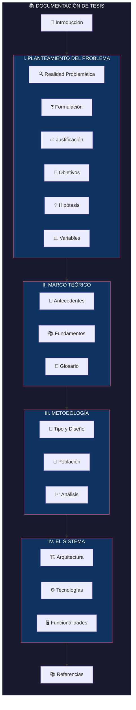
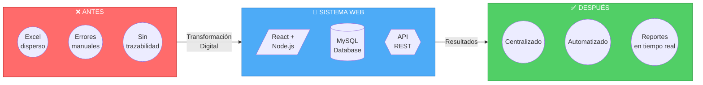
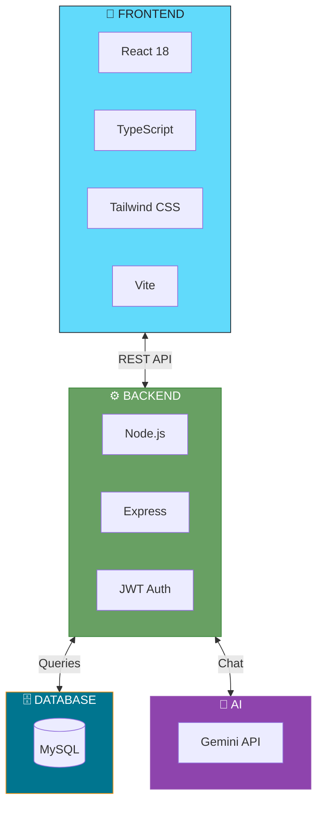

# Sistema Web LC Service

> **Implementación de un sistema web para optimizar la gestión de cotizaciones con enfoque en transformación digital en la empresa LC Service**

## Información del Proyecto

| Campo | Valor |
|-------|-------|
| **Institución** | Universidad |
| **Grado** | Bachiller en Tecnología de la Información |
| **Autores** | Anthony Adrian Chaparro Salas, Miriam Fatima Saenz Valdiviezo |
| **Asesor** | Mg. Elvis Adan Visa Ramirez |
| **Año** | 2025 |

---

## Navegación del Documento

---

## Índice de Contenidos

### Parte I: Fundamentos de la Investigación

| # | Sección | Descripción |
|---|---------|-------------|
| 1 | [Introducción](./01-introduccion.md) | Contexto y motivación del proyecto |
| 2 | [Planteamiento del Problema](./02-planteamiento-problema/README.md) | Análisis de la problemática |
| 3 | [Marco Teórico](./03-marco-teorico/README.md) | Bases teóricas y antecedentes |
| 4 | [Metodología](./04-metodologia/README.md) | Diseño de la investigación |

### Parte II: Desarrollo del Sistema

| # | Sección | Descripción |
|---|---------|-------------|
| 5 | [El Sistema](./05-sistema/README.md) | Arquitectura y desarrollo |
| 6 | [Resultados](./06-resultados.md) | Análisis pre-test y post-test |
| 7 | [Referencias](./07-referencias.md) | Bibliografía utilizada |

---

## Resumen Ejecutivo

---

## Variables de Investigación

| Variable | Tipo | Dimensiones |
|----------|------|-------------|
| **Sistema Web** | Independiente | Usabilidad, Funcionalidad, Fiabilidad |
| **Gestión de Cotizaciones** | Dependiente | Tiempo, Precisión, Satisfacción |

---

## Stack Tecnológico

---

## Contacto

- **Repositorio**: [LCService](https://github.com/decagraff/LCService)
- **Demo**: [lc-service.decatron.net](https://lc-service.decatron.net)

---

**[Comenzar Lectura →](./01-introduccion.md)**

