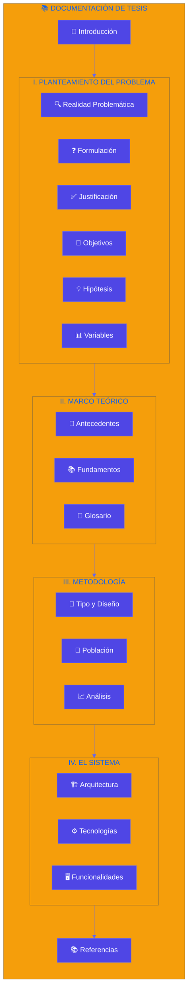
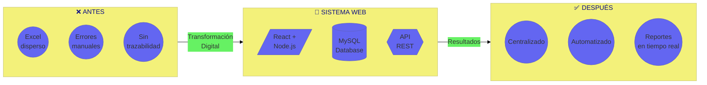
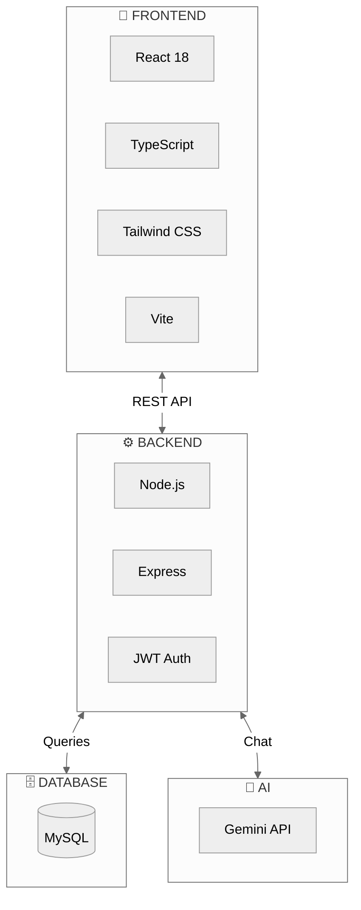

# Sistema Web LC Service

> **Implementación de un sistema web para optimizar la gestión de cotizaciones con enfoque en transformación digital en la empresa LC Service**

## Información del Proyecto

| Campo | Valor |
|-------|-------|
| **Institución** | Universidad |
| **Grado** | Bachiller en Tecnología de la Información |
| **Autores** | Anthony Adrian Chaparro Salas, Miriam Fatima Saenz Valdiviezo |
| **Asesor** | Mg. Elvis Adan Visa Ramirez |
| **Año** | 2025 |

---

## Navegación del Documento

```mermaid
%%{init: {'theme': 'base', 'themeVariables': { 'primaryColor': '#4f46e5', 'primaryTextColor': '#fff', 'primaryBorderColor': '#6366f1', 'lineColor': '#6366f1', 'secondaryColor': '#10b981', 'tertiaryColor': '#f59e0b'}}}%%
flowchart TB
    subgraph docs["📚 DOCUMENTACIÓN DE TESIS"]
        direction TB

        intro["📖 Introducción"]

        subgraph cap1["I. PLANTEAMIENTO DEL PROBLEMA"]
            prob["🔍 Realidad Problemática"]
            form["❓ Formulación"]
            just["✅ Justificación"]
            obj["🎯 Objetivos"]
            hip["💡 Hipótesis"]
            vars["📊 Variables"]
        end

        subgraph cap2["II. MARCO TEÓRICO"]
            ant["📜 Antecedentes"]
            fund["📚 Fundamentos"]
            glos["📝 Glosario"]
        end

        subgraph cap3["III. METODOLOGÍA"]
            tipo["🔬 Tipo y Diseño"]
            pob["👥 Población"]
            anal["📈 Análisis"]
        end

        subgraph cap4["IV. EL SISTEMA"]
            arq["🏗️ Arquitectura"]
            tech["⚙️ Tecnologías"]
            func["🖥️ Funcionalidades"]
        end

        ref["📚 Referencias"]
    end

    intro --> cap1
    cap1 --> cap2
    cap2 --> cap3
    cap3 --> cap4
    cap4 --> ref
```

---

## Índice de Contenidos

### Parte I: Fundamentos de la Investigación

| # | Sección | Descripción |
|---|---------|-------------|
| 1 | [Introducción](./01-introduccion.md) | Contexto y motivación del proyecto |
| 2 | [Planteamiento del Problema](./02-planteamiento-problema/README.md) | Análisis de la problemática |
| 3 | [Marco Teórico](./03-marco-teorico/README.md) | Bases teóricas y antecedentes |
| 4 | [Metodología](./04-metodologia/README.md) | Diseño de la investigación |

### Parte II: Desarrollo del Sistema

| # | Sección | Descripción |
|---|---------|-------------|
| 5 | [El Sistema](./05-sistema/README.md) | Arquitectura y desarrollo |
| 6 | [Resultados](./06-resultados.md) | Análisis pre-test y post-test |
| 7 | [Referencias](./07-referencias.md) | Bibliografía utilizada |

---

## Resumen Ejecutivo

```mermaid
%%{init: {'theme': 'base', 'themeVariables': { 'primaryColor': '#6366f1'}}}%%
graph LR
    subgraph ANTES["❌ ANTES"]
        A1(("Excel<br/>disperso"))
        A2(("Errores<br/>manuales"))
        A3(("Sin<br/>trazabilidad"))
    end

    subgraph SISTEMA["🚀 SISTEMA WEB"]
        S1[/"React +<br/>Node.js"/]
        S2[("MySQL<br/>Database")]
        S3{{"API<br/>REST"}}
    end

    subgraph DESPUES["✅ DESPUÉS"]
        D1(("Centralizado"))
        D2(("Automatizado"))
        D3(("Reportes<br/>en tiempo real"))
    end

    ANTES -->|Transformación<br/>Digital| SISTEMA
    SISTEMA -->|Resultados| DESPUES
```

---

## Variables de Investigación

| Variable | Tipo | Dimensiones |
|----------|------|-------------|
| **Sistema Web** | Independiente | Usabilidad, Funcionalidad, Fiabilidad |
| **Gestión de Cotizaciones** | Dependiente | Tiempo, Precisión, Satisfacción |

---

## Stack Tecnológico

```mermaid
%%{init: {'theme': 'neutral'}}%%
graph TB
    subgraph Frontend["🎨 FRONTEND"]
        R[React 18]
        TS[TypeScript]
        TW[Tailwind CSS]
        V[Vite]
    end

    subgraph Backend["⚙️ BACKEND"]
        N[Node.js]
        E[Express]
        J[JWT Auth]
    end

    subgraph Database["🗄️ DATABASE"]
        M[(MySQL)]
    end

    subgraph AI["🤖 AI"]
        G[Gemini API]
    end

    Frontend <-->|REST API| Backend
    Backend <-->|Queries| Database
    Backend <-->|Chat| AI
```

---

## Contacto

- **Repositorio**: [LCService](https://github.com/decagraff/LCService)
- **Demo**: [lc-service.decatron.net](https://lc-service.decatron.net)

---

**[Comenzar Lectura →](./01-introduccion.md)**

